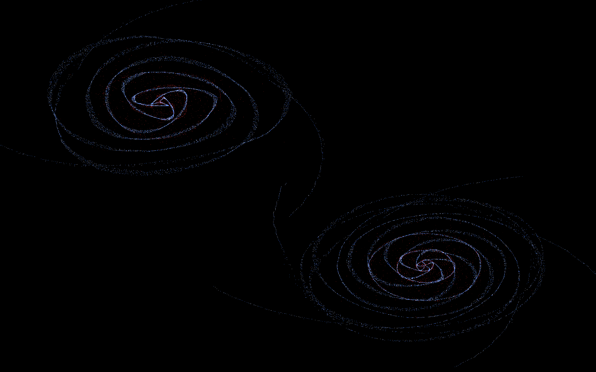

# Vulkan N-body Simulation

This is a real-time N-body simulation written in Rust using [Vulkano](https://github.com/vulkano-rs/vulkano) for Vulkan compute and graphics.

## Features

- GPU-accelerated particle interaction using Vulkan compute shaders
- Real-time rendering pipeline with Vulkano
- Minimal dependencies; pure Rust
- Scales to thousands of particles

## Gallery

### Screenshots

<p align="center">
  
  
</p>

<p align="center"><i>Left: Single galaxy | Right: Two galaxies colliding</i></p>

### Simulation in Motion

<p align="center">
  
</p>

<p align="center"><i>Five-body gravitational dance</i></p>


## Building

### Prerequisites

- Rust toolchain (install via [rustup](https://rustup.rs))
- A Vulkan-compatible GPU and drivers installed (AMD or NVIDIA)
- A working Vulkan loader (most systems have this by default)

> ⚠️ This project is currently tested only on Linux. Windows/macOS are unsupported but should work.

### Build Instructions

Clone the repository and build the project in release mode:

```bash
git clone https://github.com/Dominikkm/vulkan_n_body_simulation.git
cd vulkan_n_body_simulation
cargo build --release
```
### Running

```bash
cargo run --release
```
> It will run the default simulation

