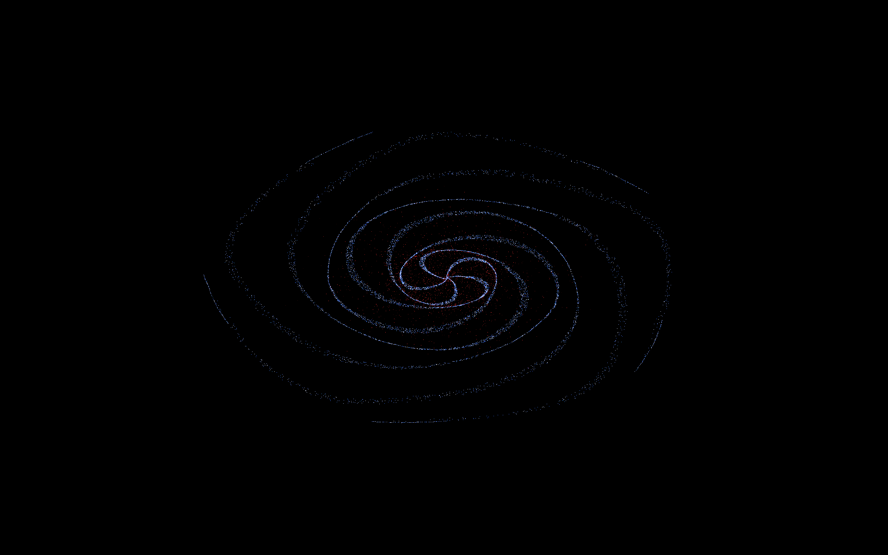
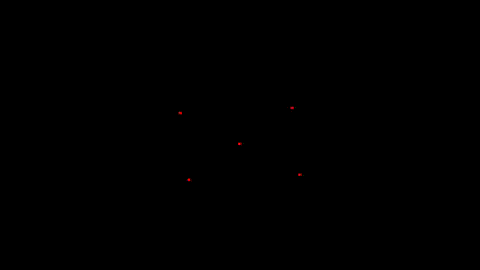

# Vulkan N-body Simulation

This is a real-time N-body simulation written in Rust using [Vulkano](https://github.com/vulkano-rs/vulkano) for Vulkan compute and graphics.

## Features

- Vulkan-powered GPU compute and rendering
- Real-time interactive simulation
- Pure Rust, no external native deps
- Scales smoothly to thousands of particles

## Gallery

### Screenshots

<p align="center">
  
  
</p>

<p align="center"><i>Left: Single galaxy | Right: Two galaxies colliding</i></p>

### Simulation in Motion

<p align="center">
  
</p>

<p align="center"><i>Five-body gravitational dance</i></p>


## Building

### Prerequisites

- Rust toolchain (install via [rustup](https://rustup.rs))
- A Vulkan-compatible GPU and drivers installed (AMD or NVIDIA)
- A working Vulkan loader (most systems have this by default)
- No Vulkan SDK is required

> ⚠️ This project is tested only on Linux. It may work on Windows/macOS, but these platforms are currently untested and unsupported.

### Build Instructions

Clone the repository and build the project in release mode:

> Building in release mode is highly recommended for smooth performance.

```bash
git clone https://github.com/Dominikkm/vulkan_n_body_simulation.git
cd vulkan_n_body_simulation
cargo build --release
```
### Configuration

Create a `config.toml` in the project root (next to `Cargo.toml`) to customize your simulation.
See the [examples folder](./examples) for ready-to-use configs.

#### Values
Each `config.toml` must include a `[constants]` section with:

- `point_size`: Size of each particle on screen. For large numbers of particles, `1.0` is a good default.
- `min_mass`: Mass threshold for coloring particles white (very light objects).
- `max_mass`: Mass threshold for coloring particles red or black (very heavy objects).

You must also define an array of `[[vertexes]]` entries, each of which has a `type` field: `"Point"` or `"Galaxy"`.

Possible values for `type = "Point"`:
- `pos`: [x, y] coordinates in the range [-1.0, 1.0]
- `vel`: [x, y] velocity vector
- `mass`: mass of the point

Possible values for `type = "Galaxy"`
- `particles`: number of particles (points) in the galaxy
- `arms`: number of spiral arms
- `twist`: how tightly the galaxy spirals
- `max_radius`: max distance from galaxy center, in [-1.0, 1.0]
- `center_pos`: [x, y] coordinates of galaxy center
- `center_vel`: [x, y] velocity vector of entire galaxy
- `center_mass`: mass at the galaxy's center; affects particle cohesion

### Running

Run the simulation with your config:

```bash
cargo run --release
```

## Running examples

To run an example:
```bash
cargo run --example {example} --release
```
In place of `{example}` pick one of the examples from [examples folder](./examples) e.g.:
```bash
cargo run --example galaxy --release
```

